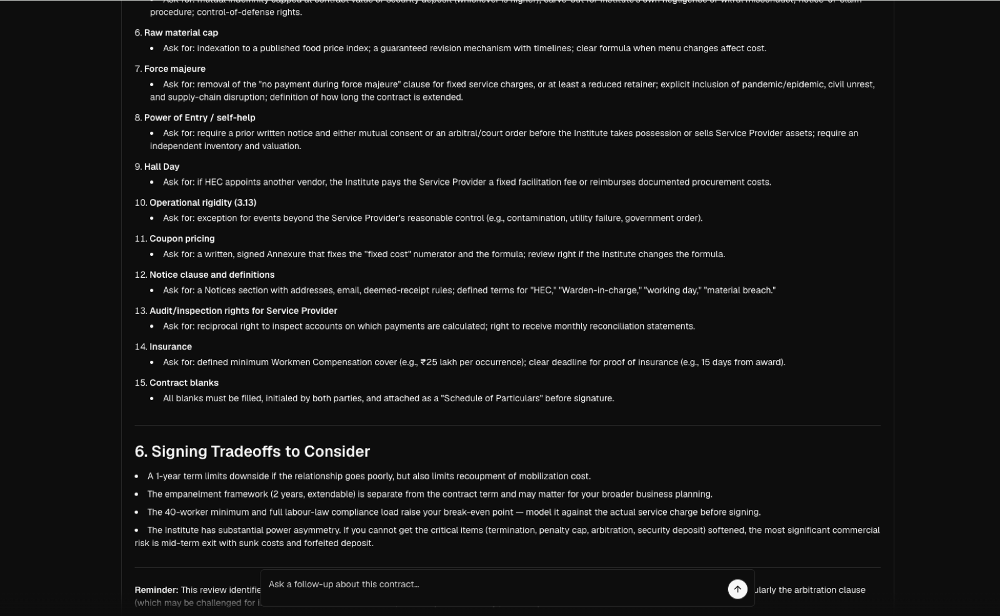

# Contract Review Agent

[](https://github.com/Nainish-Rai/contract-review-agent/blob/main/LICENSE)
[](https://vercel.com)
[](https://vercel.com/eve)
[](https://nextjs.org)

**Template.** Fork it, customize it, and deploy your own contract review agent.

[](https://vercel.com/new/clone?repository-url=https%3A%2F%2Fgithub.com%2Nainish-Rai%2Fcontract-review-agent&env=ANTHROPIC_API_KEY&envDescription=ANTHROPIC_API_KEY%3A%20Anthropic-compatible%20model%20credential%20used%20by%20the%20Eve%20agent&project-name=contract-review-agent&repository-name=contract-review-agent)

---

Open-source **contract review agent template** built on [Vercel's Eve](https://vercel.com/eve) — the filesystem-first framework for durable AI agents. Upload a PDF or DOCX contract, watch the Eve agent stream a tool-call review, and walk away with a risk report you can act on before signing.

Eve is the same framework Vercel uses to run its own agents ([vercel.com/eve](https://vercel.com/eve)). This template is what you ship when you need a vertical/legal agent: instructions in Markdown, tools in TypeScript, durable sessions by default, deploy with one click.

## Why this template

| Need | Template answer |
|---|---|
| Vercel Eve starter | ✅ Two-service `vercel.json` (`web` + `eve`), Next.js app + Eve runtime |
| AI contract review | ✅ Risk report, missing clauses, negotiation points — streamed |
| Real file parsing | ✅ PDF (`pdf-parse`) and DOCX (`mammoth`), text only, not persisted |
| Visible agent reasoning | ✅ Streaming tool calls rendered in the UI, not a black-box |
| Follow-up chat | ✅ Floating prompt input resumes the same Eve session |
| Production-shaped | ✅ Anthropic model, evals scaffold, type-safe tools |

## See it in action

<p align="center">
  
</p>

A real Eve session — numbered negotiation points (raw-material cap, force majeure, power of entry, coupon pricing, insurance, contract blanks), a Signing Tradeoffs section, and a follow-up prompt that resumes the same session. The reminder chip at the bottom tracks unresolved items across the durable conversation.

## Features

### PDF & DOCX Contract Uploads

Upload real PDF and DOCX contracts from the web app. Files are parsed per request and are not persisted by the template — each review starts from a clean slate.

### Streaming Agent Review with Tool Calls

The Eve agent streams its review with visible tool calls (`build_contract_review_state`, `review_contract_text`, `review_clause_dual`, `evaluate_contract_risk_dimensions`, `route_contract_revision`), so users see the methodology instead of getting a static black-box report.

### Risk Report

Every review focuses on plain-English summary, business risks, missing or unclear clauses, unusual terms, and suggested negotiation points — never a signing recommendation.

### Contract Review Methodology

The agent uses validity-first gates, clause coverage checks, consistency review, six risk dimensions, and revision routing adapted from Contract Review Pro. See [`agent/skills/contract-review-methodology.md`](./agent/skills/contract-review-methodology.md).

### Follow-up Chat

After the first review, keep chatting with the same Eve session from a floating prompt input. Durable sessions survive refreshes, deploys, and long pauses.

## Architecture

```text
PDF / DOCX upload
        │
        ▼
Next.js upload API
        │
        ▼
PDF / DOCX parser
        │
        ▼
Eve agent session  ─────────────►  contract-review skill
        │                              ├─ build_contract_review_state
        │                              ├─ review_contract_text
        │                              ├─ review_clause_dual
        │                              ├─ evaluate_contract_risk_dimensions
        │                              └─ route_contract_revision
        ▼
Streaming risk report  +  follow-up chat
```

On Vercel, `vercel.json` defines two services: `web` for the Next.js app and `eve` for the Eve agent runtime.

## Quick Start

**Requirements:** Node.js 24+, npm

### Deploy to Vercel

[](https://vercel.com/new/clone?repository-url=https%3A%2F%2Fgithub.com%2FNainish-Rai%2Fcontract-review-agent&env=ANTHROPIC_API_KEY&envDescription=ANTHROPIC_API_KEY%3A%20Anthropic-compatible%20model%20credential%20used%20by%20the%20Eve%20agent&project-name=contract-review-agent&repository-name=contract-review-agent)

### Self-hosting

```bash
git clone https://github.com/Nainish-Rai/contract-review-agent.git
cd contract-review-agent

npm install
cp .env.example .env.local
npm run dev
```

Open the local URL printed by Next.js and upload a `.pdf` or `.docx` contract.

**Required environment variables:**

```bash
ANTHROPIC_API_KEY=...
```

Optional:

```bash
ANTHROPIC_MODEL=claude-sonnet-4.6
```

## Customization

- Change `agent/instructions.md` to adjust the agent identity and guardrails.
- Edit `agent/skills/contract-review-methodology.md` to tune the review workflow.
- Add or change tools in `agent/tools/` for new review checks.
- Update `lib/contract-review/review.ts` for deterministic risk rules.
- Adjust `app/_components/contract-review-app.tsx` for the upload and review UI.
- Rename in [`lib/site.ts`](./lib/site.ts) (`siteName`, `siteDescription`) and
  [`app/layout.tsx`](./app/layout.tsx) metadata to rebrand as your own agent.

## Development

```bash
npm run dev        # Start Next.js with Eve
npm run typecheck  # TypeScript check
npm run build      # Production build
```

See [AGENTS.md](./AGENTS.md) for notes aimed at AI coding assistants, and
[CONTEXT.md](./CONTEXT.md) for the project's domain language.

## Built With

- [Eve](https://vercel.com/eve) — Vercel's filesystem-first framework for durable AI agents
- [Next.js](https://nextjs.org) — React framework
- [AI SDK Elements](https://elements.ai-sdk.dev) — Agent UI primitives (streaming tool calls)
- [shadcn/ui](https://ui.shadcn.com) — UI component patterns
- [pdf-parse](https://www.npmjs.com/package/pdf-parse) — PDF text extraction
- [Mammoth](https://www.npmjs.com/package/mammoth) — DOCX text extraction
- [Vercel](https://vercel.com) — One-click deploy, Workflows, Sandbox, AI Gateway

## Templates in the Vercel Eve series

- [vercel-labs/personal-agent-template](https://github.com/vercel-labs/personal-agent-template) — durable personal AI agent with web chat, Slack, Linear, memory
- [vercel-labs/eve-chat-template](https://github.com/vercel-labs/eve-chat-template) — persisted Next.js chat template for Eve
- [vercel-labs/eve-slack-agent-template](https://github.com/vercel-labs/eve-slack-agent-template) — starter Slack bot built on Eve
- **This repo** — vertical/legal contract review agent template

## Legal Disclaimer

This template surfaces practical contract-review issues. It is not legal advice and should not be treated as a signing recommendation.

## License

[MIT](./LICENSE)
